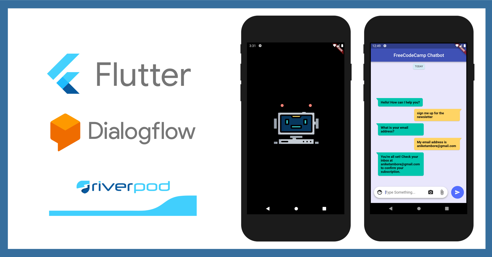

# How to develop a Chatbot using Flutter and Dialogflow with Riverpod for State Management !

This respositroy contains Stateful implementation inside of the `lib>stful` folder as well as Managing the state with Riverpod implementation inside of the `lib>stmg` folder.

## Tutorials
- Coming Soon !

## Contributing:
 - Fork it!
 - Create your feature branch: `git checkout -b my-new-feature`
 - Commit your changes: `git commit -am 'Add some feature'`
 - Push to the branch: `git push origin my-new-feature`
 - Submit a pull request.

 <h3 align="center">Show some ❤ and star the repo to support the project</h3>